# ADR 002: Database & ORM — PostgreSQL + Prisma 7

**Status:** Accepted  
**Date:** 2026-06-30

## Context

The API (`packages/api`) needs a relational store for products, carts, orders, and session data. The project runs locally via Docker Compose.

## Decision

### Database: PostgreSQL 16

`docker-compose.yml` runs `postgres:16-alpine`, mapped to host port **5433** (not the default 5432, avoiding conflict with any locally installed Postgres). A second database, `marketplace_test`, is created at container init via `docker/init.sql` and used exclusively by the test suite.

### ORM: Prisma 7 with the `pg` driver adapter

`packages/api` uses Prisma 7 (`@prisma/client`, `prisma`). Prisma 7 dropped its bundled query engine in favour of driver adapters — this project uses `@prisma/adapter-pg` backed by the `pg` npm package. The `PrismaClient` is constructed with the adapter explicitly (`new PrismaClient({ adapter })`).

A `prisma.config.ts` file exists at the package root because Prisma 7 no longer auto-loads `.env`; the config loads it manually via `dotenv` before passing `DATABASE_URL` to the datasource.

### Schema

Nine models across eight tables (domain tables snake_cased via `@@map`; the four Better Auth tables use its own default naming — see [ADR 006](006-authentication.md)):

| Model          | Table           | Notes                                                                                                        |
| -------------- | --------------- | ------------------------------------------------------------------------------------------------------------ |
| `Product`      | `products`      | Prices as `Decimal(10,2)`                                                                                    |
| `Cart`         | `carts`         | Keyed to `session_id` (unique); tied to express-session                                                      |
| `CartItem`     | `cart_items`    | Unique on `(cart_id, product_id)`; cascades delete from Cart                                                 |
| `Order`        | `orders`        | Stores Stripe payment ID, card/address snapshot, and owning `User`                                           |
| `OrderItem`    | `order_items`   | Captures price at time of order (not live product price)                                                     |
| `User`         | `user`          | Better Auth account; owns `Order`s                                                                           |
| `Session`      | `auth_sessions` | Better Auth login session (mapped off its `session` default to avoid colliding with express-session's table) |
| `Account`      | `account`       | Better Auth credential (hashed password)                                                                     |
| `Verification` | `verification`  | Better Auth email/token verification records                                                                 |

### Migrations

- `prisma migrate dev` — applies and records migrations during development
- `prisma migrate deploy` — applies existing migrations to the test DB (no schema-drift detection)
- Migration history is committed to the repo under `prisma/migrations/`

### Session store

`connect-pg-simple` persists express sessions to the same Postgres instance. It is not managed by Prisma — its table is outside the Prisma schema.

## Consequences

- Docker must be running before the API or tests can start.
- The `pg` driver adapter means Prisma behaves differently from older versions — any Prisma upgrade should check adapter compatibility first.
- `prisma.config.ts` must be kept in sync with `.env` variable names; removing it or renaming `DATABASE_URL` will break CLI commands (`migrate`, `generate`, `seed`).
- `OrderItem.price` is a snapshot, not a foreign-key reference to `Product.unit_price`. Changing a product's price does not affect existing orders.
- `Order.user_id` (added when user accounts were introduced) is a required column with no default — any environment with pre-existing order rows must clear or backfill them before applying that migration. This project has no production deployment target today; if one is added later, this migration would need to become nullable → backfill → required instead of a single additive step.
