# ADR 005: Frontend Architecture — Next.js App Router

**Status:** Accepted
**Date:** 2026-07-03

## Context

`packages/web` is a Next.js 16 (App Router, React 19) application covering product listing, product detail, cart, checkout, and order confirmation, talking to `packages/api` over HTTP.

## Decision

### Feature code colocation under `app/`

Components and lib code used by exactly one route live in that route's private `_components`/`_lib` folders (e.g. `app/checkout/_components/stripe-payment-form.tsx`, `app/checkout/_lib/stripe.ts`) rather than the top-level `components/`/`lib/`. The leading underscore opts these folders out of routing (Next.js's private-folder convention). Each such folder exposes a single barrel `index.ts` re-exporting its public members, mirroring the feature-folder/barrel pattern in `packages/api/src/features/*` (e.g. `features/cart/index.ts`). A route's `page.tsx` imports from the barrel (`./_components`); files inside the same folder import each other directly by sibling path (e.g. `add-to-cart-button.tsx` imports `./added-to-cart-modal`, not through the barrel) to avoid a self-referential circular import.

Code shared by two or more routes — `components/nav.tsx`, `components/ui/*`, `lib/api.ts`, `lib/utils.ts` — stays at the top level, imported via the `@/` alias.

### Server Components fetch data directly

Pages under `app/` (`app/page.tsx`, `app/cart/page.tsx`) are `async` Server Components that call `lib/api.ts` functions directly (`fetchProducts`, `fetchCart`) and render the result — no client-side data-fetching library or loading state for the initial page load.

### Session cookie forwarding on the server

Because SSR requests have no browser cookie jar, `app/cart/page.tsx` reads the incoming request's `Cookie` header via `next/headers` and forwards it explicitly to the API fetch, so the API sees the visitor's session (`req.session.cartId`).

### Client Components for interactivity

Components needing state, event handlers, or browser-only APIs are explicit Client Components (`"use client"`): `AddToCartButton` (local loading/error state, calls `router.refresh()` after mutating so Server Components like the nav badge re-render), `StripePaymentForm`, and `CheckoutPage`/`CheckoutForm`.

### Centralized API client with typed errors

`lib/api.ts` wraps all API calls in a single `apiFetch<T>` helper: sets `credentials: "include"` and JSON headers, and throws `ApiRequestError` (carrying `status` and the API's `code`) on non-OK responses. Callers catch `Error` and read `.message` for display; none inspect `status`/`code` today.

### Forms: react-hook-form + Zod, validated against shared schemas

`CheckoutForm` uses `useForm` with `zodResolver`, validating against `AddressSchema` imported from `@marketplace/core` — the same schema package used by the API, so client and server validation stay in sync. Field-level errors are rendered with `aria-invalid`/`aria-describedby` and `role="alert"`.

### Payments: Stripe Elements, card details never touch app state

`CheckoutPage` wraps the form in Stripe's `<Elements>` provider (`app/checkout/_lib/stripe.ts`'s `loadStripe` promise). `StripePaymentForm` renders Stripe's hosted `<CardElement>`; `CheckoutForm` calls `stripe.confirmCardPayment` directly with the element reference, then calls the API's `placeOrder` with the resulting `paymentIntentId` — raw card data never passes through the app's own state or API.

### Styling: Tailwind CSS v4 + cva component variants

Components use Tailwind utility classes directly. Reusable UI primitives (`components/ui/button.tsx`) are built with `class-variance-authority` (`cva`) for variant/size props and `@radix-ui/react-slot` for `asChild` polymorphism, following the shadcn/ui pattern. `lib/utils.ts`'s `cn` merges classes via `tailwind-merge`.

### Testing

Covered by [ADR 001](001-testing-setup.md): component tests (Vitest + RTL, MSW-mocked network) are the default; Playwright e2e is reserved for the checkout/cart critical flows.

### Component documentation: Storybook

`*.stories.tsx` files are colocated next to the component they document — `components/ui/*.stories.tsx` for shared primitives, `app/products/_components/*.stories.tsx` for route-scoped ones — mirroring the test colocation convention above. `@storybook/addon-docs` (`tags: ["autodocs"]`) generates a props-table docs page per component from its TypeScript types, `eslint-plugin-storybook` lints story files for common authoring mistakes, and `@storybook/addon-mcp` exposes the running Storybook to AI coding agents over MCP.

## Consequences

- Initial page data fetching has no client-side loading state by design (Server Components render already-fetched data); any page needing client-side fetching (`CheckoutPage`) must handle its own loading state manually, as it does today with a `cart === null` check.
- Any new SSR page that reads session-scoped data must remember to forward the `Cookie` header manually, as `next/headers` fetches don't do this automatically.
- Shared Zod schemas in `@marketplace/core` are the single source of truth for validation shape; changing a schema affects both API request validation and frontend form validation simultaneously.
- Stripe's `<CardElement>` is Stripe-hosted UI, not styled Tailwind markup — only its container is themed via `options.style.base` in `StripePaymentForm`.
- A component colocated under one route's `_components` folder that later needs to be used by a second route must be promoted back to the shared top-level `components/` (or `lib/`) — colocation trades cross-route reuse for keeping route-specific code out of the shared namespace.
