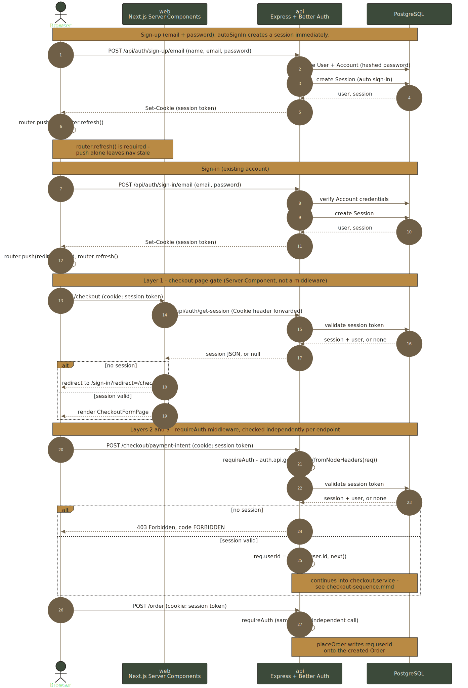

# ADR 006: Authentication — Better Auth, Gated at Checkout

**Status:** Accepted
**Date:** 2026-07-07

## Context

Browsing, product pages, and the cart were fully anonymous — `packages/api` had no concept of a user, and `Order` had no owner. The product wants that to stay true for browsing and cart-building, but requires a signed-in account to purchase, and wants orders attributable to a user (setting up order history later, though that UI isn't built yet). See `docs/superpowers/specs/2026-07-07-user-auth-design.md` for the original design brainstorm and `docs/superpowers/plans/2026-07-07-user-auth.md` for the implementation plan this ADR reflects.

## Decision

### Library: Better Auth, mounted on the Express API

`packages/api` uses [Better Auth](https://better-auth.com) (`better-auth`) with its Prisma adapter, running inside the existing Express app rather than as a separate auth service. `packages/api/src/shared/auth.ts` constructs the instance:

```ts
betterAuth({
  database: prismaAdapter(prisma, { provider: "postgresql" }),
  emailAndPassword: { enabled: true },
  trustedOrigins: ["http://localhost:3000"],
});
```

Email + password only — no email verification (no email-sending provider is wired up; `emailAndPassword.requireEmailVerification` is left at its default `false`) and no social/OAuth login. `autoSignIn` is left at Better Auth's default (`true`), so sign-up immediately establishes a session.

`src/app.ts` mounts the handler ahead of `express.json()`:

```ts
app.all("/api/auth/*splat", toNodeHandler(auth));
app.use(express.json());
```

Better Auth's Node adapter parses the request body itself; running `express.json()` first causes its client to hang on "pending" (a hard requirement from Better Auth's own docs, not a stylistic choice).

### Two independent "session" concepts, deliberately not unified

This project already had `express-session` + `connect-pg-simple` (see [ADR 002](002-database-and-orm.md)) tracking the anonymous cart via `req.session.cartId`, backed by a Postgres table literally named `session`. Better Auth's own session model defaults to the _same_ table name. Rather than merge these two unrelated concepts — one is an anonymous, unauthenticated cart pointer; the other is an authenticated user's login session — the Prisma schema keeps them separate by mapping Better Auth's `Session` model to `auth_sessions` instead of its default:

```prisma
model Session {
  # ...
  @@map("auth_sessions")
}
```

This is purely a SQL table rename — Better Auth's Prisma model name (and therefore `prisma.session.*` calls) is unaffected, since `@@map` only changes the underlying table, not the Prisma Client property. No other code changes were needed to keep the two systems apart. The cart stays keyed to the `express-session` cookie regardless of auth state; a signed-in user's cart is not merged or migrated across the anonymous→authenticated boundary.

### Schema: `User`, `Session`, `Account`, `Verification`, plus `Order.user_id`

Better Auth's standard tables were added via its documented Prisma shape (`packages/api/prisma/schema.prisma`), using its own default naming convention (singular, lowercase table names, camelCase columns) rather than this project's snake_case/plural convention elsewhere — left as-is since it's library-managed schema, not a hand-authored domain table.

`Order` gained a required `user_id` (`String`, FK to `User.id`, no default). Every order is now owned by a user; `placeOrder` requires it to be supplied. See [ADR 002](002-database-and-orm.md#consequences) for the migration constraint this creates (no backfill path for pre-existing order rows — acceptable today since this project has no production deployment target, but would need a nullable→backfill→required migration if one is added).

### Auth boundary: enforced independently at three layers



Only checkout requires a session, and it's checked in three places that don't depend on each other — a UI-only gate would be bypassable via direct API calls:

1. **`app/checkout/page.tsx`** (Next.js, server-rendered): an async Server Component calls `getServerSession()` and `redirect("/sign-in?redirect=/checkout")` if there's no session, before rendering the actual checkout form (`CheckoutFormPage`, colocated under `app/checkout/_components/`).
2. **`POST /checkout/payment-intent`**: gated by `requireAuth` middleware.
3. **`POST /order`**: gated by `requireAuth` middleware; `placeOrder` writes `req.userId` onto the created order.

`packages/api/src/shared/middleware/require-auth.ts` calls `auth.api.getSession()` (via `fromNodeHeaders(req.headers)`) and throws the existing `ForbiddenError` (403) if there's no session — it fails closed, and is plain middleware (not a service), consistent with the routes-thin/services-hold-logic split in [ADR 004](004-api-architecture.md). The pre-existing cart-ownership IDOR check (`cartId !== req.session.cartId`) is unchanged and runs independently of the auth check.

`GET /order/:id` is deliberately left ungated — it has no owner check today (a pre-existing gap this work didn't introduce or attempt to close; order history/ownership on reads is out of scope until that feature is built).

### Client-side: two different ways to read the session

`packages/web` never talks to Postgres directly; it always goes through the API, using the same cookie-forwarding pattern already established for the cart (ADR 005):

- **Client Components** (sign-in/sign-up forms, the nav's sign-out button) use `better-auth/react`'s `createAuthClient`, exported as `authClient` from `lib/auth-client.ts`, pointed at the API's base URL.
- **Server Components** (the checkout gate, the nav's signed-in/signed-out rendering) use `lib/get-server-session.ts`'s `getServerSession()` — a plain `fetch` to `GET /api/auth/get-session`, forwarding the incoming request's `Cookie` header exactly like `lib/api.ts`'s `fetchCart` does for the cart. This is not Better Auth's own server helper (`auth.api.getSession`) because that requires being in the same process as the `auth` instance; `packages/web` and `packages/api` are separate processes.

Both are read-only wrappers; neither embeds any auth _logic_ — signing in/out and session validation are entirely Better Auth's responsibility.

### After any auth mutation, `router.refresh()` is required, not optional

`router.push()` alone leaves Server Component output (particularly the nav's signed-in state) stale after sign-in/sign-up, because Next's client-side Router Cache can serve a previously-cached render of a route the user is navigating to. Every client-side auth mutation (`sign-up-form.tsx`, `sign-in-form.tsx`, `sign-out-button.tsx`) calls `router.refresh()` immediately alongside `router.push()`/after the mutation — this was a real bug caught via manual browser verification after initial implementation (a hard reload showed the correct state; the client-side transition didn't), not a defensive habit copied blindly.

## Consequences

- Checkout's auth requirement is enforced redundantly by design (page + two endpoints) — any future checkout-adjacent endpoint must remember to add `requireAuth` itself; there is no shared route-level guard that applies it automatically.
- `GET /order/:id` has no ownership check — anyone with an order ID can currently read it. Acceptable for today's scope (no order-history UI exists yet to make IDs discoverable in bulk), but must be revisited before building order history.
- Adding a new Better Auth table that happens to share a name with an existing non-Prisma table (as `session` did) will silently show up as Prisma migration drift, not a clear "naming collision" error — check `@@map` names against `packages/api/src/shared/middleware/session.ts` and any other unmanaged tables before adding new Better Auth plugins/tables.
- No password reset flow exists (no email provider configured); email/password is the only credential recovery path Better Auth is configured to support today.
- Local dev/test secrets (`BETTER_AUTH_SECRET`, `BETTER_AUTH_URL`) live in the gitignored `packages/api/.env`/`.env.test`, following the same pattern as `SESSION_SECRET`/`STRIPE_SECRET_KEY` — a fresh checkout or worktree needs these copied in manually, same as the other secrets in that file.
